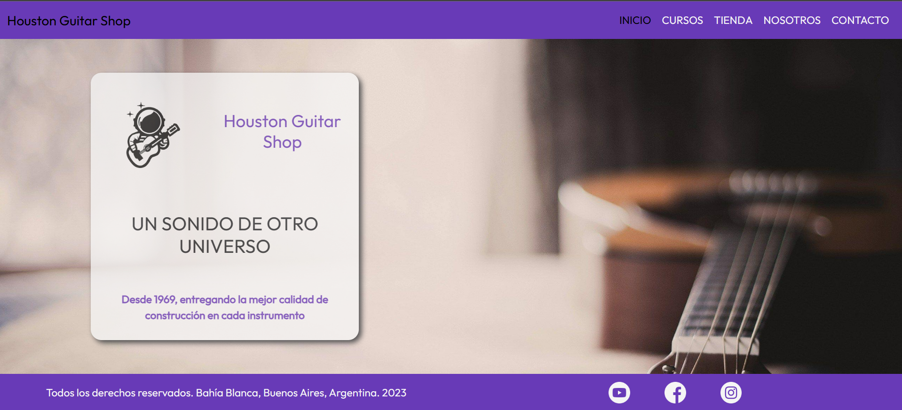

# Houston Guitar Shop

##Descripcion

Houston Guitar Shop se presenta como una tienda de guitarras que ademas dicta cursos para todas las edades y niveles. Posee 5 paginas, incluyendo el index.
Esta hecha para crear una armonia en lo visual, siguiendo las mismas lineas de diseño a lo largo de todas sus paginas.

##Profesores y tutores

Profesor: Maximiliano Cárdenas

Tutores:

Joaquín De La Parra

Yeison Rodriguez

Tutor adjunto: Damian Laterza

##Tecnologias utilizadas

-HTML5 -CSS3 -BOOTSTRAP -SCSS

##Caracteristicas

-Pagina principal a modo de presentacion de la marca.
-Seccion de tienda y cursos, a modo de ofrecer servicios y productos relacionados con el tema de la web.
-Seccion de Nosotros, donde damos informacion de nuestro trabajo y el cliente al cual estamos enfocados.

##Screenshot

##Contacto

Si tiene alguna duda o sugerencia, puedes enviarme un mensaje privado a traves de las plataformas y redes sociales.
